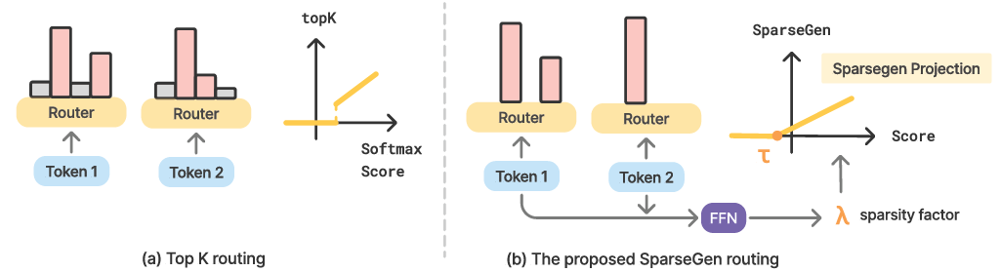

# LD-MoLE(ICLR 2026)

LD-MoLE, a learnable dynamic routing framework for Mixture of LoRA Experts that replaces conventional non-differentiable Top-K routing with a Sparsegen-based differentiable routing mechanism. The approach employs a shared MLP to predict token-specific and layer-wise sparsity parameters (λ), enabling adaptive and flexible expert allocation. Additionally, an analytical sparsity control objective is incorporated to regularize expert activation and encourage efficient expert utilization.

# Get Start

## Environment Setup (Conda, Python 3.10)

Create and activate the environment:

```bash
conda create -n LD-MoLE python=3.10
conda activate LD-MoLE
```

Install PyTorch (stable CUDA 12.4):

```bash
pip install torch torchvision torchaudio --index-url https://download.pytorch.org/whl/cu124
```

Install project dependencies:

```bash
pip install -r requirements.txt
```

Optional nightly PyTorch (CUDA 12.8), if you want nightly instead of stable:

```bash
pip install --pre torch torchvision torchaudio pytorch-triton \
    --index-url https://download.pytorch.org/whl/nightly/cu128
```

# Datasets
## [ARC](https://huggingface.co/datasets/allenai/ai2_arc)
## [CommonsenseQA](https://huggingface.co/datasets/tau/commonsense_qa)
## [OpenbookQA](https://huggingface.co/datasets/allenai/openbookqa)
## [HellaSwag](https://huggingface.co/datasets/Rowan/hellaswag)
## [Swag](https://huggingface.co/datasets/allenai/swag)
## [MMLUPro](https://huggingface.co/datasets/TIGER-Lab/MMLU-Pro)
## [GLUE](https://huggingface.co/datasets/nyu-mll/glue/)

# Training
1. To switch between datasets, change `dataset` and `task` in [run.sh](run.sh). For mrpc and rte use "glue" for dataset and same as task otherwise, e.g. "arc_c", "mmlu_pro", "hellaswag".
2. To switch between different models, change `model` in [run.sh](run.sh). Right now we only support llama3.1_8b, llama3.2_1b, llama3.2_3b, qwen3_0.6b, qwen3_1.7b.

To run the code, please use the following cmd
```
bash run.sh
```
